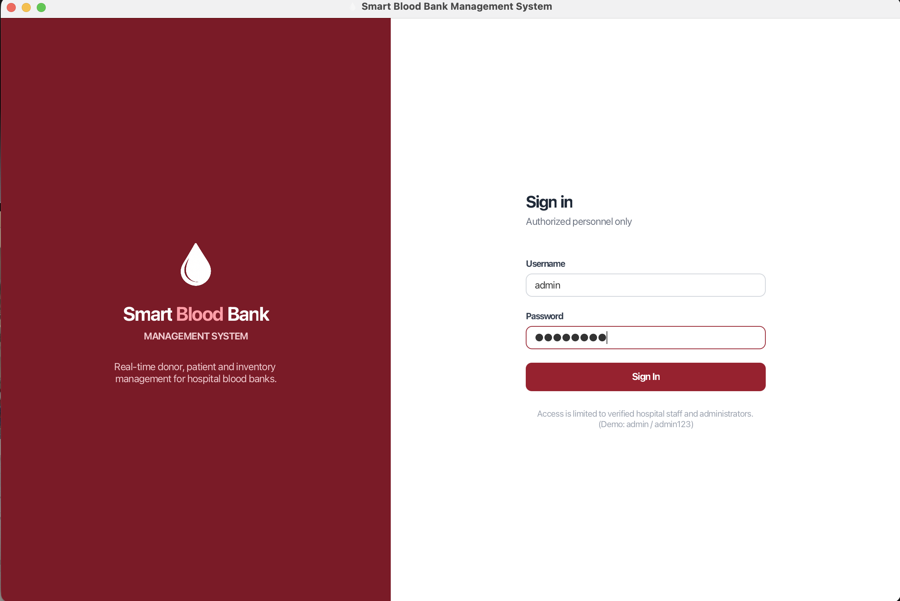
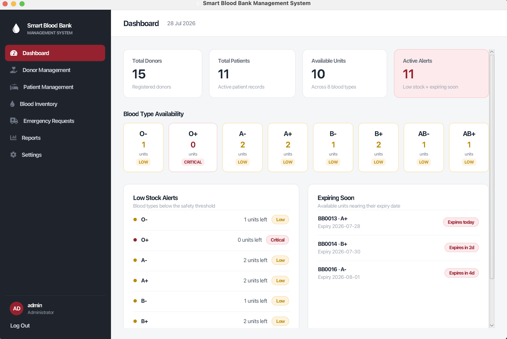
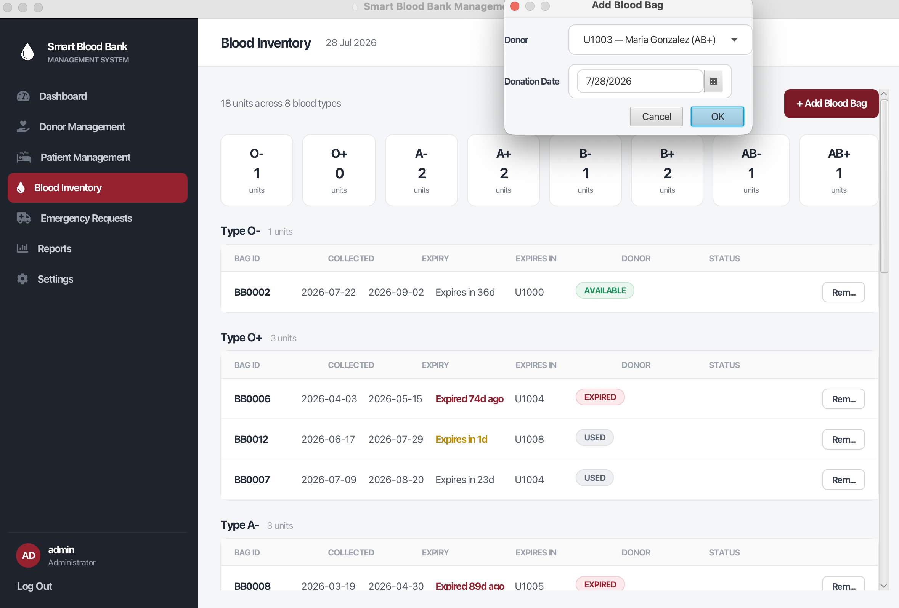
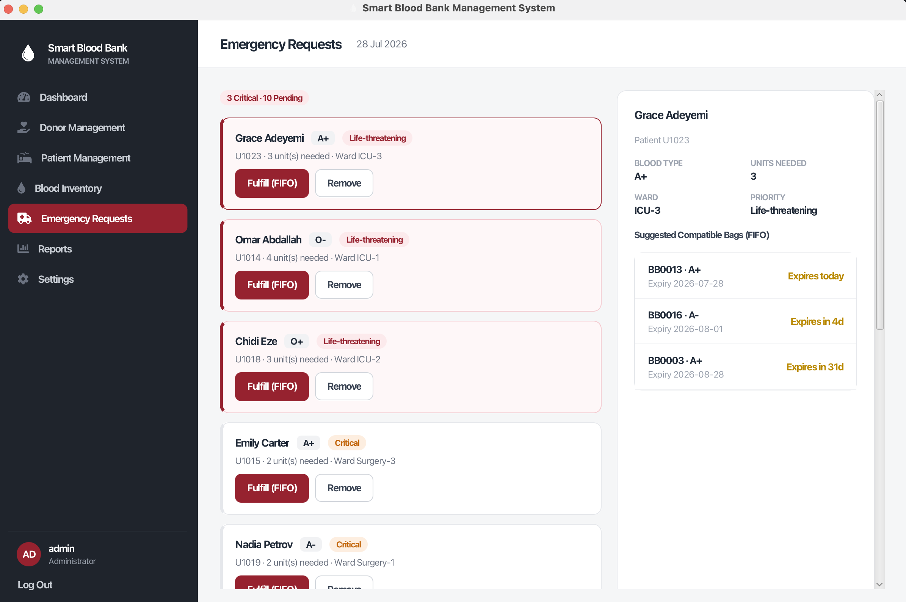
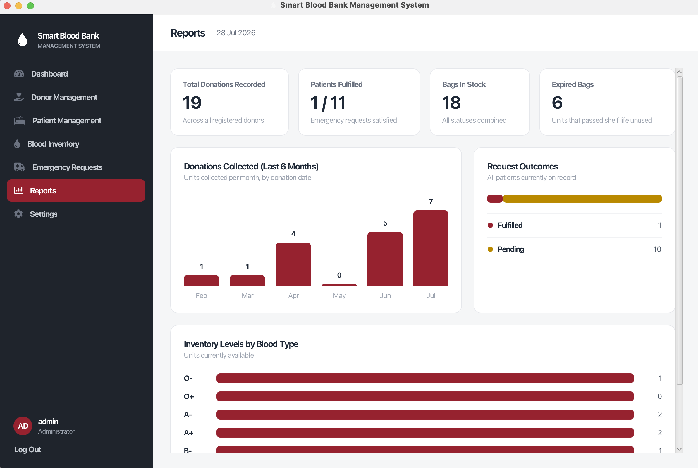
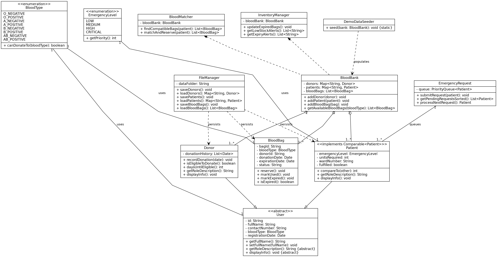

# Smart Blood Bank Management System

> **An intelligent JavaFX desktop application that simulates real hospital blood bank operations with automatic blood matching, emergency prioritization, inventory monitoring, and persistent data management.**


---

# Demo Video

> **Watch the full project demonstration below**


---

# Table of Contents

- [Overview](#-overview)
- [Features](#-features)
- [Screenshots](#-screenshots)
- [Architecture](#-architecture)
- [System Design](#-system-design)
- [Project Structure](#-project-structure)
- [Application Startup](#-application-startup)
- [Emergency Request Workflow](#-emergency-request-workflow)
- [Object-Oriented Programming](#-object-oriented-programming)
- [Technologies](#-technologies)
- [Getting Started](#-getting-started)
- [Demo Credentials](#-demo-credentials)
- [Sustainable Development Goal](#-sustainable-development-goal)
- [Author](#-author)

---

# Overview

The **Smart Blood Bank Management System** is a JavaFX desktop application developed using Object-Oriented Programming principles.

Unlike traditional CRUD-based systems, this project simulates real hospital blood bank operations by combining intelligent blood matching, emergency prioritization, inventory monitoring, expiry tracking, and persistent data storage.

The project supports **United Nations Sustainable Development Goal 3 (Good Health and Well-being)** by demonstrating how software can improve blood bank efficiency and reduce delays during emergency situations.

---

# Features

## Donor Management

- Register new donors
- Edit donor information
- Delete donor records
- Record blood donations
- Track donation history
- Enforce the 90-day donation interval

---

## Patient Management

- Register patients
- Update patient information
- Delete patient records
- Submit emergency blood requests
- Track blood requirements
- Mark fulfilled requests

---

## Blood Inventory

- Add blood bags
- View inventory by blood type
- Automatic expiry date calculation (42 days)
- Track blood bag status
- Organize inventory efficiently

Blood Bag Status:

- Available
- Reserved
- Used
- Expired

---

## Intelligent Blood Matching

The system automatically:

- Checks blood compatibility
- Finds compatible blood bags
- Selects the earliest expiring units (FIFO)
- Reserves inventory automatically
- Prevents incompatible transfusions

---

## Emergency Priority Queue

Emergency requests are automatically sorted according to urgency:

1. Critical
2. High
3. Medium
4. Low

The highest-priority patient is always processed first.

---

## Dashboard & Reports

The dashboard provides:

- Total donors
- Total patients
- Available blood units
- Blood stock by type
- Low-stock alerts
- Near-expiry alerts
- Fulfillment statistics

---

## Data Persistence

The application automatically:

- Loads saved data on startup
- Generates demo data on first launch
- Saves all changes when the application closes

---

# Screenshots

## Login Screen



---

## Dashboard



---

## Blood Inventory



---

## Emergency Requests



---

## Reports



---

# Architecture

```text
                 JavaFX UI
                     │
                     ▼
          ┌────────────────────┐
          │     UI Layer       │
          │ JavaFX Screens     │
          └─────────┬──────────┘
                    │
                    ▼
          ┌────────────────────┐
          │   Service Layer    │
          │ Business Logic     │
          └─────────┬──────────┘
                    │
                    ▼
          ┌────────────────────┐
          │    Model Layer     │
          │ Data & Rules       │
          └────────────────────┘
```

The project follows a layered architecture where:

- **UI** handles presentation only.
- **Service** contains all business logic.
- **Model** represents the application's data and business rules.

---

# System Design

The following UML Class Diagram illustrates the object-oriented design of the application and the relationships between the main classes.



---
# Project Structure

```text
src
└── main
    └── java
        └── com.smartbloodbank
            ├── model
            ├── service
            └── ui
```

## Model

- User
- Donor
- Patient
- BloodBag
- BloodType
- EmergencyLevel

## Service

- BloodBank
- BloodMatcher
- InventoryManager
- EmergencyRequest
- FileManager
- DemoDataSeeder

## UI

- Login
- Dashboard
- Donor Management
- Patient Management
- Blood Inventory
- Emergency Requests
- Reports
- Settings

---

# Application Startup

```text
Application Starts
        │
        ▼
MainApp.start()
        │
        ▼
AppContext
        │
        ├───────────────┐
        │               │
        ▼               ▼
 Load Saved Data   Seed Demo Data
        │
        ▼
 Login Screen
        │
 Authentication
        │
        ▼
 Dashboard
        │
        ▼
 System Modules
```

---

# Emergency Request Workflow

```text
Patient Creates Request
          │
          ▼
Emergency Queue
          │
          ▼
Priority Sorting
          │
          ▼
BloodMatcher
          │
          ▼
Compatibility Check
          │
          ▼
Reserve Blood Bags
          │
          ▼
Update Inventory
          │
          ▼
Fulfill Patient Request
```

---

# Object-Oriented Programming

| Principle | Implementation |
|-----------|----------------|
| Encapsulation | Private fields with controlled state transitions |
| Inheritance | User → Donor, Patient |
| Polymorphism | Different implementations of abstract methods |
| Abstraction | Abstract User and Screen classes |

---

# Technologies

- Java 21
- JavaFX
- Maven
- Object-Oriented Programming (OOP)
- Collections Framework
- Priority Queue
- File-Based Persistence

---

# Getting Started

## Prerequisites

Before running the project, make sure the following software is installed:

- Java Development Kit (JDK) 21
- Apache Maven
- JavaFX 21
- IntelliJ IDEA (Recommended)
- Git (Optional)

---

## Clone the Repository

```bash
git clone https://github.com/bandarbwz/SmartBloodBank.git
```

---

## Navigate to the Project

```bash
cd SmartBloodBank
```

---

## Run the Application

```bash
mvn javafx:run
```

---

# Demo Credentials

```text
Username : admin
Password : admin123
```

---

# Sustainable Development Goal

## SDG 3: Good Health and Well being

This project supports **United Nations Sustainable Development Goal 3 (Good Health and Well being)**.

The system demonstrates how intelligent software can improve blood allocation, emergency response, and inventory management in healthcare environments.

---

# Author

Developed as an Object Oriented Programming (OOP) course project using JavaFX, demonstrating software engineering principles, layered architecture, and healthcare management simulation.
